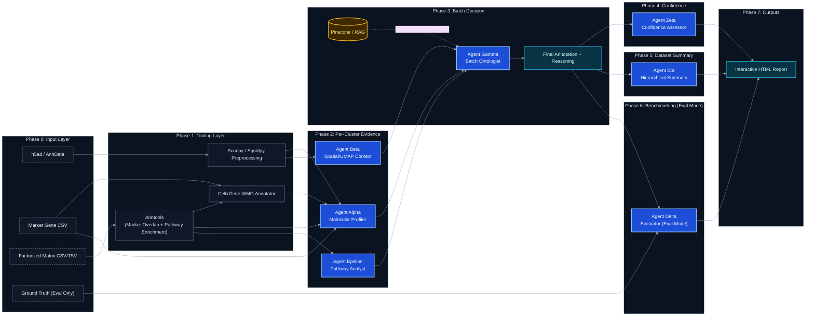

# TranScribe

**Automated Cell-Type Annotation via Multi-Agent LLM Orchestration**

TranScribe is a high-performance framework that leverages generative AI (Gemma 3, Gemini) to automate cell-type annotation in single-cell (scRNA-seq) and spatial transcriptomics. By orchestrating seven specialized agents, TranScribe transitions raw gene clusters into biologically coherent lineage annotations with full transparency and reasoning traces.

## 🧬 Key Features

- **Seven-Agent Orchestration**: Alpha, Beta, Epsilon, Gamma, Zeta, Eta, and Delta work in a 4-phase pipeline.
- **Factorized Data Support**: Annotate latent factors from NMF, cNMF, or other matrix decomposition methods.
- **Batch Factorized Processing**: Automatically discover and annotate all factorization ranks in a directory, outputting to a single tabbed HTML report.
- **Anntools Integration**: Automated Marker Overlap (Geneset scoring) and Pathway Enrichment (gProfiler) for Factorized mode; marker overlap is consumed by Agent Alpha, while pathway enrichment is consumed by Agent Epsilon.
- **Spatial Transcriptomics Support**: Integrated support for Visium and other spatial technologies via `squidpy`.
- **Inference & Evaluation**: Supports both "Run Mode" (new datasets) and "Benchmark Mode" (against ground truth).
- **CellxGene WMG Integration**: High-fidelity cell-type matching using the official CZ CellxGene Census (50M+ reference cells).
- **Interactive Reports**: Rich HTML dashboards with sticky UMAPs, **Spatial Plots**, trace logs, and reasoning cards.
- **CSV Data Export**: One-click summary export for batch runs, capturing experiment names, clusters, predicted cell types, DEGs, and detailed reasoning.
- **Simplified CLI**: Unified configuration-driven workflow.
- **RAG Enabled**: Optional integration with Pinecone for knowledge-retrieval (Agent Gamma).

## 🏗️ Architecture

TranScribe employs a decoupled, multi-agent architecture where specialized LLM agents interact over a unified transcriptomic record. 

### 1. Unified Agent Workflow



### 2. Data Types & Inputs
- **Single-Cell Input**: Standard `.h5ad` files or standalone **Marker Gene CSV** files (directed to Agent Alpha). Requires a `cluster_col` (Leiden/Louvain) for `.h5ad` inputs.
- **Factorized Input**: Directly annotate gene weights/spectra from **NMF/cNMF matrix decomposition** (CSV, TSV, TXT formats).
- **Census Integration**: Standalone **CellxGene WMG** annotator to query 50M+ reference cells using cluster-specific marker lists.
- **Spatial Input**: Visium-style `.h5ad` with `adata.uns['spatial']`. Supported modalities: `single-cell`, `spatial`, `factorized`.
- **RAG Enrichment (Optional)**: If enabled, Agent Gamma queries a vector database (Pinecone) for the latest cell ontology definitions to resolve ambiguous annotations.

### 3. Execution Pipelines
- **Inference Pipeline**: Used for new, unannotated data. Outputs best-guess labels with full reasoning chains.
- **Benchmark Pipeline**: Used for validation. Measures semantic and exact accuracy against ground truth, generating a head-to-head model comparison report.

### 4. Modality-Specific Coordination
- **Single-cell mode**: Alpha and Epsilon run per cluster from independent inputs (DEG/candidate evidence for Alpha; pathway-tool evidence for Epsilon), then **Beta runs once in batch** across all clusters using UMAP proximity context before Gamma performs batch finalization.
- **Spatial mode**: Beta runs per cluster using spatial neighborhood context.
- **Factorized mode**: Beta is bypassed; Gamma integrates Alpha + Epsilon evidence across all clusters.
- **Evaluation report composition**: Eta always contributes hierarchical experiment-level summary; Delta contributes biological match evaluation **only when `ground_truth_col` is provided** (evaluation mode).

### 5. Trace Semantics (HTML Report)
- **Alpha Input Evidence**: concise molecular evidence and candidate labels (confidence is not assigned here).
- **CellxGene Evidence Handling**: candidates are filtered (`score >= 20`) and capped to top 3. If only one candidate is available, only the prediction is shown.
- **Gamma Batch Input (Per Cluster)**: Top 20 DEGs + CellxGene retrieval + Alpha candidates + Epsilon summary fields (`Primary Theme`, `Secondary Themes`, `States`, `Summary`) + Beta context.
- **Epsilon Input / Epsilon Output**: pathway step is recorded in strict input/output form, with emphasis on state/program interpretation.
- **Beta Batch UMAP Critique**: shown in single-cell runs when Beta is executed in batch mode.
- **Global Batch Gamma Trace**: remains available for whole-dataset decision auditing.

## 🤖 Agent Roles

TranScribe's orchestration consists of seven specialized agents, executed in a strict 4-phase architecture:

- **Agent Alpha (Molecular Profiler)**: Phase 1. Analyzes transcriptomic signals (DEGs and expression profiles) to propose candidate cell identities. Alpha does not assign confidence.
- **Agent Beta (Spatial/UMAP Contextualizer)**: Phase 1/Batch bridge. Uses neighborhood context (spatial neighbors or UMAP proximity) to test whether candidate labels are contextually plausible.
- **Agent Epsilon (Pathway Analyst)**: Phase 1. Interprets enriched pathways as biological programs/states and outputs structured themes/summaries for downstream integration.
- **Agent Gamma (Batch Ontologist & Critic)**: Phase 2. Final decision-maker across all clusters. Integrates CellxGene, DEGs, Alpha, Epsilon, and Beta evidence to produce final `cell_type`, `ontology_id`, and reasoning.
- **Agent Zeta (Confidence Assessor)**: Phase 3. Sole owner of confidence assessment via programmatic marker overlap (`|observed & expected| / |expected|`) and agreement narrative.
- **Agent Eta (Descriptor)**: Phase 4. Construct a hierarchical biological summary (lineage tree) of the entire experiment.
- **Agent Delta (The Evaluator)**: Specializes in biological nomenclature comparisons during benchmark runs.

## 🚀 Getting Started

### 1. Installation

```bash
git clone https://github.com/MorrissyLab/TranScribe.git
cd TranScribe

# Sync dependencies using uv
uv sync

# Activate the virtual environment
# On Windows:
.venv\Scripts\activate
# On Linux/macOS:
# source .venv/bin/activate
```

### 2. Environment Setup
Create a `.env` file in the root directory:
```env
GOOGLE_API_KEY="[ENCRYPTION_KEY]"
MODEL_NAME="gemma-3-12b-it"
PINECONE_INDEX="your-index" (optional)
```

## 🛠️ How to Run

### Option A: Using Config Files (Recommended)
Configs are stored in the `configs/` directory. Define your models, datasets, and mode (`eval` or `infer`) in the YAML.

```bash
# Run multi-model evaluation benchmark
uv run python -m transcribe.cli run --config configs/eval_single_cell_config.yaml

# Run spatial transcriptomics evaluation (Visium)
uv run python -m transcribe.cli run --config configs/eval_spatial_config.yaml

# Run factorized data evaluation (cNMF/spOT-NMF)
uv run python -m transcribe.cli run --config configs/eval_factorized_config.yaml

# Run multi-model inference annotation
uv run python -m transcribe.cli run --config configs/infer_single_cell_config.yaml
```

### Option B: Single-File Inference
For quick annotation of a single `.h5ad` file:

```bash
# Single-cell RNA-seq
uv run python -m transcribe.cli run --data_path data/pbmc3k.h5ad --cluster_col leiden

# Spatial transcriptomics (automatic detection)
uv run python -m transcribe.cli run --data_path data/spatial.h5ad --cluster_col clusters --modality spatial
```

### Option C: Batch Factorized Inference
To annotate all factorization ranks in a directory (e.g., `k_5` to `k_70` from cNMF):

```bash
uv run python -m transcribe.cli run --config configs/batch_factorized_config.yaml
```

### Option D: CellxGene Census Annotation (NEW)
To perform high-fidelity annotation of a marker-gene Excel file using the CellxGene WMG API:

```bash
# Basic run
.venv\Scripts\transcribe.exe annotate-census --excel "path/to/markers.xlsx"

# With Tissue and Organism filters
.venv\Scripts\transcribe.exe annotate-census --excel "path/to/markers.xlsx" --organism "Human" --tissue "Sarcoma"
```

## 📂 Project Structure

- `src/transcribe/`: Core engine and agent logic.
- `configs/`: YAML run configurations.
- `results/`: Output directories for evaluation and inference reports.
- `docs/`: Expanded project documentation and architecture details.

---
*Developed by Aly O. Abdelkareem*
