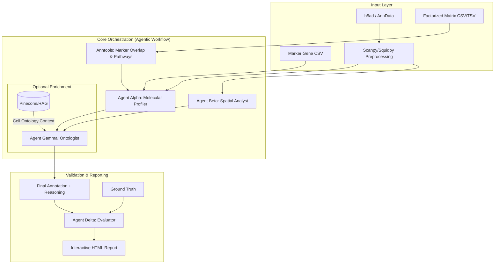

# TranScribe

**Automated Cell-Type Annotation via Multi-Agent LLM Orchestration**

TranScribe is a high-performance framework that leverages generative AI (Gemma 3, Gemini) to automate cell-type annotation in single-cell (scRNA-seq) and spatial transcriptomics. By orchestrating a tri-agent framework, TranScribe transitions raw gene clusters into deeply understood biological lineages with full transparency and reasoning traces.

## 🧬 Key Features

- **Tri-Agent Framework**: Alpha (Molecular Profiler), Beta (Spatial Analyst), and Gamma (Ontologist) work in concert.
- **Factorized Data Support**: Annotate latent factors from NMF, cNMF, or other matrix decomposition methods.
- **Anntools Integration**: Automated Marker Overlap (Geneset scoring) and Pathway Enrichment (gProfiler) for Factorized mode, providing Agent Alpha with deep functional context beyond raw gene weights.
- **Spatial Transcriptomics Support**: Integrated support for Visium and other spatial technologies via `squidpy`.
- **Inference & Evaluation**: Supports both "Run Mode" (new datasets) and "Benchmark Mode" (against ground truth).
- **Interactive Reports**: Rich HTML dashboards with sticky UMAPs, **Spatial Plots**, trace logs, and reasoning cards.
- **Simplified CLI**: Unified configuration-driven workflow.
- **RAG Enabled**: Optional integration with Pinecone for knowledge-retrieval (Agent Gamma).

## 🏗️ Architecture

TranScribe employs a decoupled, multi-agent architecture where specialized LLM agents interact over a unified transcriptomic record. 

### 1. Unified Agent Workflow



### 2. Data Types & Inputs
- **Single-Cell Input**: Standard `.h5ad` files or standalone **Marker Gene CSV** files (directed to Agent Alpha). Requires a `cluster_col` (Leiden/Louvain) for `.h5ad` inputs.
- **Factorized Input**: Directly annotate gene weights/spectra from **NMF/cNMF matrix decomposition** (CSV, TSV, TXT formats).
- **Spatial Input**: Visium-style `.h5ad` with `adata.uns['spatial']`. Supported modalities: `single-cell`, `spatial`, `factorized`.
- **RAG Enrichment (Optional)**: If enabled, Agent Gamma queries a vector database (Pinecone) for the latest cell ontology definitions to resolve ambiguous annotations.

### 3. Execution Pipelines
- **Inference Pipeline**: Used for new, unannotated data. Outputs best-guess labels with full reasoning chains.
- **Benchmark Pipeline**: Used for validation. Measures semantic and exact accuracy against ground truth, generating a head-to-head model comparison report.

## 🤖 Agent Roles

TranScribe's orchestration consists of four specialized agents, each with a distinct biological mandate:

- **Agent Alpha (Molecular Profiler)**: Analyzes purely transcriptomic signals (DEGs and expression profiles) to propose potential candidate cell types. In factorized mode, it leverages **Anntools** outputs (marker overlap and pathway scores) to identify lineage-specific markers and functional states with high precision.
- **Agent Beta (Spatial Analyst)**: Active only in spatial transcriptomics runs. It evaluates the "nichecard" (neighborhood frequencies) of a cluster to determine if Alpha's candidates are spatially plausible (e.g., verifying if a neuron is actually located in a neuronal neighborhood).
- **Agent Gamma (Ontologist & Critic)**: The final decision-maker. It synthesizes the molecular evidence from Alpha and the spatial critique from Beta, optionally cross-referencing against an external Knowledge Base (RAG), to produce a standardized cell-type annotation.
- **Agent Delta (The Evaluator)**: Specializes in biological nomenclature. During benchmarks, Delta compares predictions against ground truth labels to determine if they are "biologically equivalent" (e.g., matching "CD14+ Monocyte" with "Monocyte").

## 🚀 Getting Started

### 1. Installation

```bash
git clone https://github.com/MorrissyLab/TranScribe.git
cd TranScribe

# Sync dependencies using uv
uv sync

# Activate the virtual environment
# On Windows:
.venv\Scripts\activate
# On Linux/macOS:
# source .venv/bin/activate
```

### 2. Environment Setup
Create a `.env` file in the root directory:
```env
GEMINI_API_KEY="[ENCRYPTION_KEY]"
MODEL_NAME="gemma-3-12b-it"
PINECONE_INDEX="your-index" (optional)
```

## 🛠️ How to Run

### Option A: Using Config Files (Recommended)
Configs are stored in the `configs/` directory. Define your models, datasets, and mode (`eval` or `infer`) in the YAML.

```bash
# Run multi-model evaluation benchmark
python -m transcribe.cli --config configs/eval_single_cell_config.yaml

# Run spatial transcriptomics evaluation (Visium)
python -m transcribe.cli --config configs/eval_spatial_config.yaml

# Run factorized data evaluation (cNMF/spOT-NMF)
python -m transcribe.cli --config configs/eval_factorized_config.yaml

# Run multi-model inference annotation
python -m transcribe.cli --config configs/infer_single_cell_config.yaml
```

### Option B: Single-File Inference
For quick annotation of a single `.h5ad` file:

```bash
# Single-cell RNA-seq
python -m transcribe.cli --data_path data/pbmc3k.h5ad --cluster_col leiden

# Spatial transcriptomics (automatic detection)
python -m transcribe.cli --data_path data/spatial.h5ad --cluster_col clusters --modality spatial
```

## 📂 Project Structure

- `src/transcribe/`: Core engine and agent logic.
- `configs/`: YAML run configurations.
- `results/`: Output directories for evaluation and inference reports.
- `docs/`: Expanded project documentation and architecture details.

---
*Developed by Aly O. Abdelkareem*
